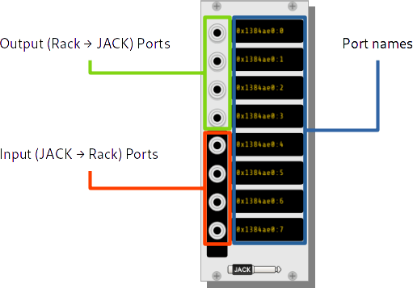

This plugin adds support for the JACK Audio Connection Kit to VCV Rack.
Modules are taken from VCV Core, modified to interact directly with
JACK instead of RtAudio and also modified to support JACK-isms like
named ports.

The JACK Audio module deals with passing audio between Rack and JACK
ports and wires. Each port can be named individually, with the supplied
name appearing in the JACK patch bay for use with other applications.

Note that if you connect audio both in to Rack and also to an
output mixer, you will notice a delay in the output signals. This is
because JACK is more similar to VST where a host asks for samples
to be processed in bulk, while Rack prefers to process samples
individually on its own time. While this is not a problem if you are
using Rack to synthesize audio for a piece, you may need to consider
having audio pass through Rack back to another output if you need to
tightly synchronize Rack output with say, pre-recorded vocals or a
beat from Hydrogen.

There be dragons here.

# Missing features
* MIDI
* Timing

# Known bugs
* Sample rate conversion doesn't work so well (make sure JACK and Rack are set to the same value, ex. 44100)
